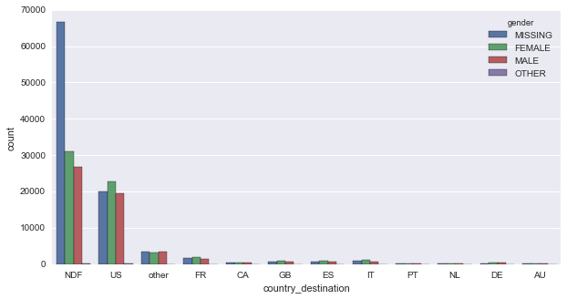
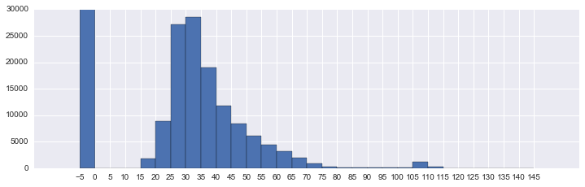

# Airbnb New User Bookings

## 1. Problem Definition

How do we predict user intent based on their online behavior? Knowing what people's motivations are as they use a web or app can help businesses and service providers show more relevant content and provide greater value.

In this report we look at a [kaggle competition posted by Airbnb](https://www.kaggle.com/c/airbnb-recruiting-new-user-bookings) that asks competitors to predict the country where a new guest will book their first travel experience. Accurate predictions allow Airbnb to share more personalized content, decrease booking time, and better forecast demand. The competition is posted as a recruiting challenge and provides good motivation to explore a problem that a real-world employer considers important.

### Describe a solution and Identify metrics

Using data provided by Airbnb about US users' demographic and web session records we make 5 predictions per user of where they will stay. Of the 12 possible outcomes, there are 11 destination countries ('US':USA, 'FR':France, 'CA':Canada, 'GB':Great Britain, 'ES':Spain, 'IT':Italy, 'PT':Portugal, 'NL':Netherlands, 'DE':Germany, 'AU':Australia) and 1 outcome of no destination found ('NDF').

Our predictions are evaluated using [NDCG](https://www.kaggle.com/c/airbnb-recruiting-new-user-bookings/details/evaluation). The 5 predictions made per user should be ordered so the most probable destination goes first. The NDCG metric gives higher weight to correct predictions that are higher in order, with a perfect score of 1 and lowest score of 0.

For example, if a user's destination is 'FR' then the score would be higher for a prediction of ['FR', 'US'] than for ['US', 'FR']:
  - ['FR', 'US'] gives a score = (2^1 - 1 / log2(1+1)) + (2^0 - 1 / log2(2+1)) = 1 + 0 = 1
  - ['US', 'FR'] gives a score = (2^0 - 1 / log2(1+1)) + (2^1 - 1 / log2(2+1)) = 0 + 1/1.585 = 0.63


A valid solution will produce a model that can achieve an NDCG score of 0.88 or higher on the Public Leaderboard (LB), which would make the top 150 (of 1000+ entries). The Public LB is calculated on 30% of the test data, while the final competition results (or, "Private LB") are based on the other 70%. We use the Public LB to evaluate our performance because most of our work was performed prior to the competition end date 02/11/16.

As a benchmark, we find that a model which predicts the 5 most common outcomes (in order, NDF-US-Other-FR-IT)
achieves a Public LB score of 0.85359 (Private 0.85670).

## 2. Exploratory analysis

The train users data has 213451 users and 15 features. The target variable is `country_destination` and there is a column `date_first_booking` that appears to indicate when the booking was made (if the target variable isn't 'NDF').
There is demographic info for age and gender as well as user data such as dates of visits, signup details, and how the user accessed the service.

The test users data has 62096 users and the same 15 features found in the train set. Even though the target variable isn't present, there is still a column for `date_first_booking` that is populated with null values.

There are also 3 additional files that may help our predictions:
**sessions.csv**: web sessions log for users
**countries.csv**: summary statistics of destination countries in this dataset and their locations
**age_gender_bkts.csv**: summary statistics of users' age group, gender, country of destination
### Country destination (target variable)

Over half the train users did not book a destination ('NDF'), and the 'US' is the most common destination country.

**destination, count, pct**  
NDF, 124543, .5834  
US, 62376, .2922  
other, 10094,	.0472  
FR , 5023,	.0235  
IT, 2835,	.0132  
GB, 2324,	.0108  
ES, 2249,	.0105  
CA, 1428,	.0066  
DE, 1061,	.0049  
NL,  762,	.0035  
AU,  539,	.0025  
PT, 217,	.0010  

### Missing data

After replacing the value '-unknown-' in feature `gender` with nan there are 4 features with null values (`date_first_booking`, `gender`, `age`, `first_affiliate_tracked`. The `date_first_booking` nulls can be ignored because they will ultimately not be used to make predictions, and we will fill in the remining null values.

### Gender
Many users have missing gender info, and there are more female users than male.  It also appears that the overall distribution of gender in the train user data does not replicate precisely for each country, so it could be useful in our predictions.





### Age
There are missing many age values, and some of the existing values appear inaccurate. There are ages as low as 1 and as high as 2014. We will address these values during feature pre-processing.

In the below chart there is a modal peak in the 30-35 bucket, with a large proportion of users falling in the 25-35 range. Removing values above 100 produces a set with mean 36.5, median 34.0, and std dev 11.7.


    missing values: 87990
    values above 1900: 779





### Age Gender Buckets csv file

The data is useful in exploring how user demographics seem to impact the destination, but is not merged with the train user data to make predictions. We instead rely on the trained classifier to detect these relationships.

### Countries csv file

Some tests were performed that joined `language_levenshtein_distance` in this file to the rest of the user data on `destination_language`, but the feature did not improve prediction accuracy.

### Identity suitable ML algorithm(s)

We approach this multi-class classification problem with supervised learning of [Decision trees](http://scikit-learn.org/stable/modules/tree.html#tree). Decisions trees predict a target variable by learning simple decision rules detected in feature data, and are appropriate here for some of the following reasons:
- can handle numerical and categorical data
- can handle multiple classes
- can handle missing data

However, decision trees can often produce weak classifiers, so we utilize two ensemble methods to improve predictive power. First we use a [random forest classifier](http://scikit-learn.org/stable/modules/ensemble.html#forest), an ensemble method that fits a number of decision trees on subsamples of a dataset and averages results. Next we use XGBoost, which has proven [effective in kaggle competitions](https://no2147483647.wordpress.com/2014/09/17/winning-solution-of-kaggle-higgs-competition-what-a-single-model-can-do/).

[XGBoost](https://github.com/dmlc/xgboost) is an optimized distributed gradient boosting library designed to be highly efficient, flexible and portable. It implements machine learning algorithms under the Gradient Boosting framework, which produces an ensemble of weak decision tree learners via additive training (boosting).

Attempts were made to model the data with a muliple layer neural net using Google's [TensorFlow](https://www.tensorflow.org/) library, but performance of the model did not improve on the benchmark (Public score 0.85359, Private 0.85670), most likely due to suboptimal tuning of the model hyperparameters or inadequate feature data pre-processing. This could be an interesting method to pursue further in order to improve prediction performance.

## 3. Solution implementation

### Pre-process the data
**Date features**  
There are two date format features (`date_account_created`, `timestamp_first_active`) that we separate into 3 columns each: year, month, day. We then create a new feature to capture the days difference between the two (`dac_tfa`).

**Age**  
We keep all age values between 0-99 and explore two options to deal with values >99.
- Option 1: treat all ages 100+ the same as nulls by converting to -1.
- Option 2: retain all values up to 1900 and assume that those above 1900 refer to a year that can convert to age by subtracting from 2015.

**One hot encoding features**  
We engineer categorical data so that each unique value gets a separate column with a 1 or 0 value.

**Feature selection**  
After one hot encoding we end up with 162 features. We use all columns in the train_users and test_users csv files except `id`, `date_first_booking`, and `country_destination`, including:  
```
	date_account_created
	timestamp_first_active
	dac_tfa: days difference between date_account_created and timestamp_first_active
	gender
	age
	signup_method
	signup_flow: the page a user came to signup up from
	language: international language preference
	affiliate_channel: what kind of paid marketing
	affiliate_provider: where the marketing is e.g. google, craigslist, other
	first_affiliate_tracked: whats the first marketing the user interacted with before the signing up
	signup_app
	first_device_type
	first_browser
```

There were some experiments with removing features that created many columns during one hot encoding (such as first_browser) in order to reduce dimensionality, but this didn't improve performance of the classifier.

### Implement and measure performance
We first train the random forest model with 25 estimators using [grid search](http://scikit-learn.org/stable/modules/generated/sklearn.grid_search.GridSearchCV.html) and a [custom NDCG scorer](https://www.kaggle.com/davidgasquez/airbnb-recruiting-new-user-bookings/ndcg-scorer) from kaggle scripts. The parameters we search over are:

    'min_samples_split': [2, 20],
    'max_depth': [6, 8]

After doing the grid search, we find the best classifier has max depth 6 and min samples split 20.

    mean: 0.79675, std: 0.00522, params: {'min_samples_split': 20, 'max_depth': 6}

We [submit our predictions](https://www.kaggle.com/c/airbnb-recruiting-new-user-bookings/submit) on the test data and get a result of 0.85407 (Private score 0.85702). This is only slightly better than our benchmark of 0.85359 (Private 0.85670).

### Iterate and reflect
To improve our performance, we do the following:
- Revisit age feature: use Option 2 to deal with the age values >99.
- Merge sessions data: use the sessions data by grouping users by `user_id` and `action_detail` and counting each unique `action_detail` event per `user_id`. The events are one hot encoded so that each unique value gets a separate column with a 1 or 0 value, resulting in 316 total features.
- Train XGBoost classifier: use the [sklearn interface for XGBoost](https://github.com/dmlc/xgboost/blob/master/python-package/xgboost/sklearn.py) to train our model for 50 rounds.

Below are some of the parameters tuned in the XGBoost model:
- change the objective to 'multi:softprob' to handle multiclass classification
- increase the max_depth to 6 to enable learning a more complex model
- increase learning_rate to 0.25 to make boosting less conservative
- decrease subsample to 0.8 and colsample_bytree to 0.7 to help prevent overfitting

Instead of grid search we split the train data further into training and validation sets and stop training early if our validation error does not improve in 10 rounds. Our evaluation metric is 'merror', which calculates #(wrong cases)/#(all cases). During previous experiments this metric was shown to have generally the same success on the test set as multiclass logloss. Attempts to use NDCG were not successful.

### Comparing the predictions
Below we see the resulting NDCG scores. Another XGBoost classifier was also trained with the "Option 1" treatment of age used with the Random Forest model.

The XGBoost with "Option 2" treatment of age was the only approach that achieved a Public score above 0.88.
However, the XGBoost with "Option 1"did have a slightly better Private score.

### <center>NDCG Scores</center>

Model | Convert age | Validation <br>score | Test <br>(Public score) | Test <br>(Private score)
------|:-----------------:|:--------------:|:-------------------:|:-------------------:|
XGBoost | Option 2  | 0.83187 | 0.88007 | 0.88454
XGBoost |    Option 1    | 0.83337 | 0.87924 | 0.88458
Random Forest (no sessions data) | Option 1 | 0.79675 | 0.85407 | 0.85702
Benchmark (repeat top 5) | — | — | 0.85359 | 0.85670

### Concluding remarks

Working on this project illustrated how much work can go into pre-processing data before fitting a model,
including joining data from multiple files, one hot encoding categorical variables, and handling missing or erroneous data

In addition, the process of feature selection showed how much flexibility exists in the creation and utilization of features. There were many parts of the provided data that were used but ultimately discarded, and there are many more features that could have been created but were not tested out.

Some of the feature selection ideas that were explored but didn't improve performance include:
- PCA reduced data to 30 dimensions
- Discarding age values at "reasonable" points like under 14 and over 90
- Summing `secs_elapsed` in session data didn't improve on using the number of unique `action_detail` events
- Adding `language_levenshtein_distance` from the countries file

Lastly, it was fun to iterate on predictions to the kaggle site to see how much improvement could be made on the leaderboard. The process definitely gave me confidence to enter future competitions as well as apply machine learning techniques to new datasets outside Udacity.
